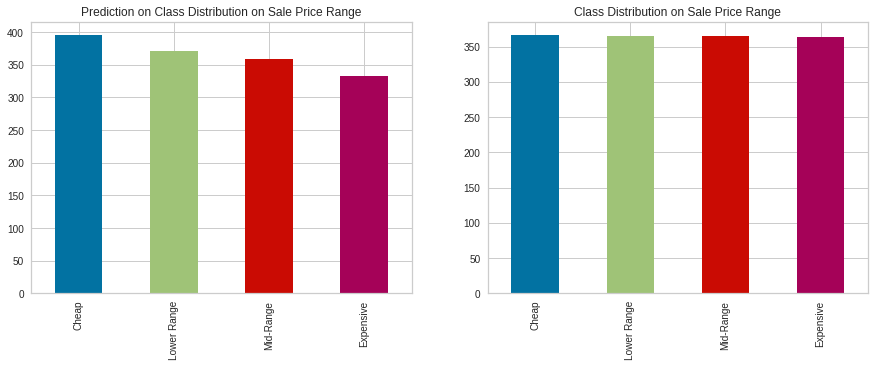
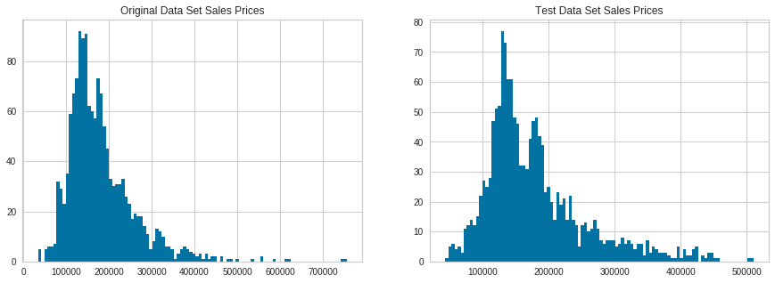

# House_Price_Prediciton

House Prediction on Kaggle Dataset
https://www.kaggle.com/c/house-prices-advanced-regression-techniques

Using machine learning is essentially applying algorithms to extract information from raw data and then represent that data in a model.  Once the model has been created, we will then be able to infer things about new sets of data not yet modelled.
I have performed visualizations to see how the sales price is affected by the other features in the data set. By using several machine learning algorithms I was able to train the model and predict the 'House Sales Price' for the test data set.

The test data set sale price range prediction is evenly distributed.

The histograms below will show us the sale price distribution on the original data versus the test data.

